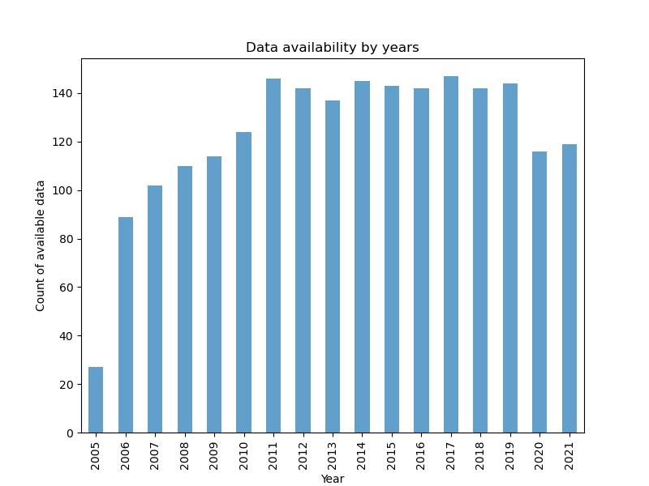
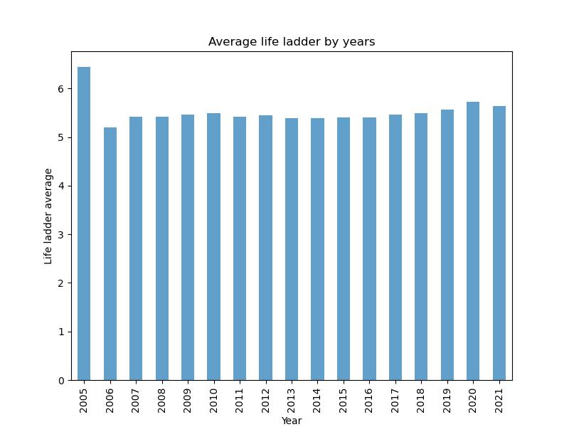

# Group 1 Project 1
Group 1 Project 1 Git Collaboration - Data Analytics Bootcamp

Team Members: 
Julia Begley,
Hasan Gokceoglu,
Isil Bulut,
Violetta Antonova

# Executive summary

The World Happiness Report is an annual publication that measures the happiness levels of countries around the world based on various factors such as economic growth, social support, freedom to make life choices, generosity, and trust in government and business institutions. The report provides valuable insights into the factors that contribute to the well-being of people and the overall happiness of a nation.

Overall, this dataset provides a valuable resource for researchers, policymakers, and anyone interested in understanding global happiness trends and the factors contributing to well-being.

# Questions to dataset
* What is the relationship between social support and generosity?
* Is there a positive relationship between happiness scores and their country’s healthy life expectancy?
* What changes were there in happiness levels in Covid years?
* Did confidence in governments change during Covid years?
* What is the relationship between confidence in the government, freedom to make life choices, and perceived corruption?
* How do these metrics differ globally or regionally?

# Data Cleanup and Analysis

We used Python to wotk with data. All our code is stored in Jupiter notebook. We used Pandas to read a csv file. Some of us renamed the column name for next usage and also cleaned data using dropna finction. Also we used group by function, to group data by Years or by Country name. As well, we defined function for drawing scatter plot with linear regression line and finding correlation.

After cleaning and completing grouping process we used Matplotlib to make charts. Using pyplot we were able to creat bar charts, scatter plots and maps. Also for presentation purpose we created WorldCloud chart with heart shape using our csv file Country name column.

We used API such as Geoapify that contains longitude and latitude for drawing map.

# Summary for dataset

The Word Happiness report data is available from year 2005 to 2021. As we can se from chart below for year 2005 we have small amount of data available, only 27 counties were participated in research, also for year 2006 only 89 countries take part in research.

The life ladder column represent data of people happiness. Respondents were asked to think of a ladder, with the best possible life for them being a 10 and the worst possible life being a 0. They are then asked to rate their own current lives on that 0 to 10 scale.

The chart below shows us average Life Ladder score from the year 2005 to year 2021. We can see that from year 2006 to 2020 our bar schart is slightly going up, but in year 2021 Life ladder score is dropping. Our assumptios was that people become less happier, because of Covid-19. Unfurtanetely it's not the main purpose of our project and this assumption could be gread start for the future projects.

Top 10 Happiest and 10 Unhappiest countries

Let's look at Top 3 most Happiest countries it's Denmark, Finland and Switzerland all the countries are located in Europe and two of them in Scandinavia.
3 less Happiest countries are Zimbabwe, Yemen, Comoros. Two of them are located in Africa and one close to Africa. So may be the cold weather makes people more happier, then worm climate, It's also great opportunity for future researches, because in The World Happiness report don't have any information about weather and how weather affect peoples happiness. But for sure We can state that in Europe and Scandinavian countries GDP per catita is more higher than in Africa.

# Life Ladder:

It asks respondents to think of a ladder, with the best possible life for them being a 10 and the worst possible life being a 0. They are then asked to rate their own current lives on that 0 to 10 scale.

**Healthy life expectancy at birth:**

Healthy Life Expectancy (at birth) is the average number of years a person would expect to live in good health in a particular area based on modern mortality rates in that area and prevalence of self-reported good health.

**Correlation Coefficient Ranges:**

### Question: Is there any coreleation between Life Ladder and Healthy life expectancy at birth?

As a first step,  we check the whole available data of World Happiness Report between 2005 and 2021 for "Life Ladder" and "Healthy Life of Expectance at Birth". Please see fig1

Correlation co-efficient value between Life Ladder and Healthy life expectancy at birth is: 0.71
This means Assotiation between Life Ladder and Healthy life expectancy at birth is very high

2- Secondly; for each country, we took the average values of "Life Ladder" and "Healthy life expectancy at birth" and again compare the values corelations.

Correlation co-efficient value between Life Ladder and Healthy life expectancy at birth is: 0.77
This means Assotiation between Average Life Ladder and Healthy life expectancy at birth is also very high

# Relationship of Freedom to make life choices and Perceptions of corruption with Confidence in national government.

How this data were collceted?

In each country people were asked about each part of their life. To collect data for Freedom to make life choice people were asked: Are you satisfied or dissatisfied with your freedom to choose what you do with your life? They must give an answer in between 0 and 1 and then country mean is calculated. Same process was with Perception of corruption - Is corruption widespread within businesses or not? and also for Confidence in national government - Is corruption widespread throughout the government or not?

Before to look at relationships of data I would like to look at each parameter by year to find what is going on overall. Corruption level that could be seen on chart on the right side - from year 2007 to year 2021 the corruption level is slightly going down. Three the most corrupted countries are: Romania (0.949), Bosnia and Herzegovina (0.942) and Bulgaria (0.938). Three less corrupted countries are: Rwanda (0.185), Qatar                 (0.183) and Singapore (0.101).

As we can see from the chart below on the left side - Average on Freedom to make life choices by years, that from year 2007 to year 2020 out chart is going up. So by the years people feel that they have more fredom to make choices, but in year 2021 the value drops down. I assume that it could be related with Covid-19 restrictions to travel around the worls and in the UK there were restrictions even to travel inside the country. Top three countries the most highest score are: Norway (0.952), Denmark (0.944) and Finland (0.941). Norway, Denmark and Finland are in top 10 less corrupted countries.

I'm not looking at the year 2005 and 2006, because in that years the amount of data available is relatively small and also less than 100 countries were participated in research.

Let's look at correlations.

<li><strong>Correlation between Freedom to make life choices with Confidence in national government. </strong>
  
As we can see from the plot that correlation between Freedom to make life choices with Confidence in national government is possitive, taht means that when Freedom to make life choices is going up, Confidence in national government is also going up. Correlation coefficient between this two variables is 0.4, that means that correlation is moderate.
  

  
<li><strong>Correlation between Perceptions of corruption with Confidence in national government. </strong>
  
As we can see from the plot that correlation between Perceptions of corruption with Confidence in national government is negative, taht means that when Perceptions of corruption is going up, Confidence in national government is going down. Correlation coefficient between this two variables is -0.46, that means that correlation is moderate.
  

