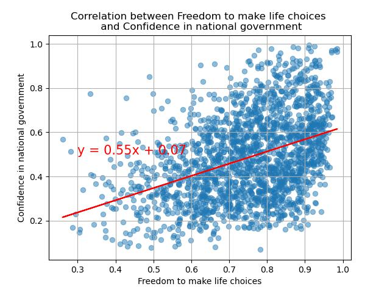

# group1_project1
Group 1 Project 1 Git Collaboration - Data Analytics Bootcamp

<strong>About Dataset</strong>

<ul><li><strong>Overview</strong>
The World Happiness Report is an annual publication that measures the happiness levels of countries around the world based on various factors such as economic growth, social support, freedom to make life choices, generosity, and trust in government and business institutions. The report provides valuable insights into the factors that contribute to the well-being of people and the overall happiness of a nation.

Overall, this dataset provides a valuable resource for researchers, policymakers, and anyone interested in understanding global happiness trends and the factors contributing to well-being.

<li><strong>Columns:</strong>
<ul><li>Country name
<li>Year
<li>Life Ladder
<li>Log GDP per capita
<li>Social support
<li>Healthy life expectancy at birth
<li>Freedom to make life choices
<li>Generosity
<li>Perceptions of corruption
<li>Positive affect
<li>Negative affect
<li>Confidence in national government</li></ul></ul>

# Relationship of Freedom to make life choices and Perceptions of corruption with Confidence in national government.

Before to look at relationships of data I would like to look at each parameter by year to find what is going on overall. Corruption level that could be seen on chart on the right side - from year 2007 to year 2021 the corruption level is slightly going down. Three the most corrupted countries are: Romania (0.949), Bosnia and Herzegovina (0.942) and Bulgaria (0.938). Three less corrupted countries are: Rwanda (0.185), Qatar                 (0.183) and Singapore (0.101).

As we can see from the chart below on the left side - Average on Freedom to make life choices by years, that from year 2007 to year 2020 out chart is going up. So by the years people feel that they have more fredom to make choices, but in year 2021 the value drops down. I assume that it could be related with Covid-19 restrictions to travel around the worls and in the UK there were restrictions even to travel inside the country. Top three countries the most highest score are: Norway (0.952), Denmark (0.944) and Finland (0.941). Norway, Denmark and Finland are in top 10 less corrupted countries.

I'm not looking at the year 2005 and 2006, because in that years the amount of data available is relatively small and also less than 100 countries were participated in research.

Let's look at correlations.

<li><strong>Correlation between Freedom to make life choices with Confidence in national government. </strong>
  
As we can see from the plot that correlation between Freedom to make life choices with Confidence in national government is possitive, taht means that when Freedom to make life choices is going up, Confidence in national government is also going up. Correlation coefficient between this two variables is 0.4, that means that correlation is moderate.
  

  
<li><strong>Correlation between Perceptions of corruption with Confidence in national government. </strong>
  
As we can see from the plot that correlation between Perceptions of corruption with Confidence in national government is negative, taht means that when Perceptions of corruption is going up, Confidence in national government is going down. Correlation coefficient between this two variables is -0.46, that means that correlation is moderate.
  

  
 
  
